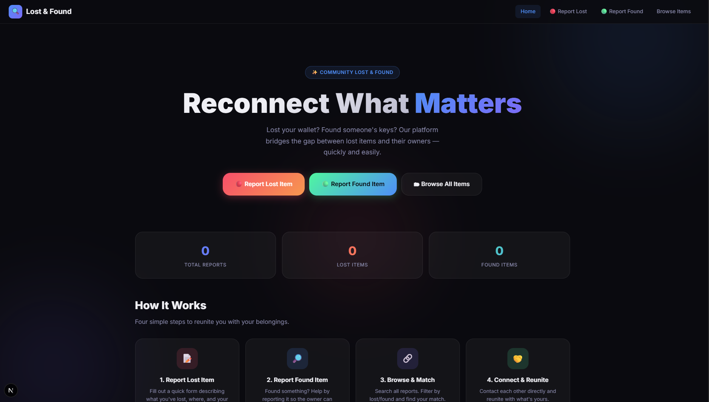
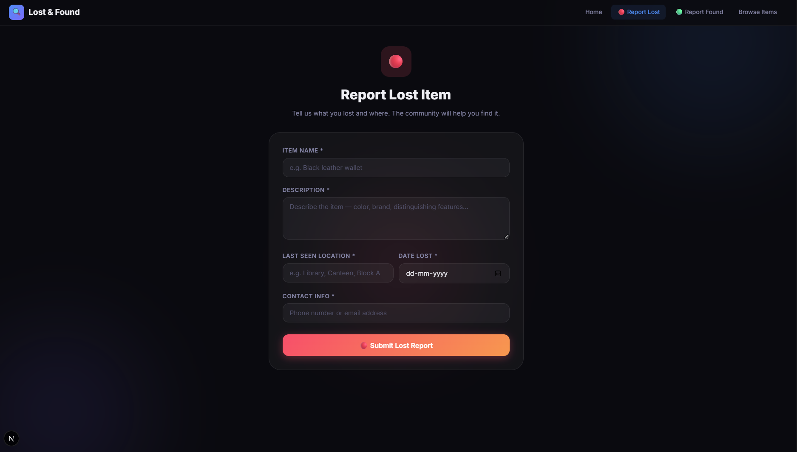
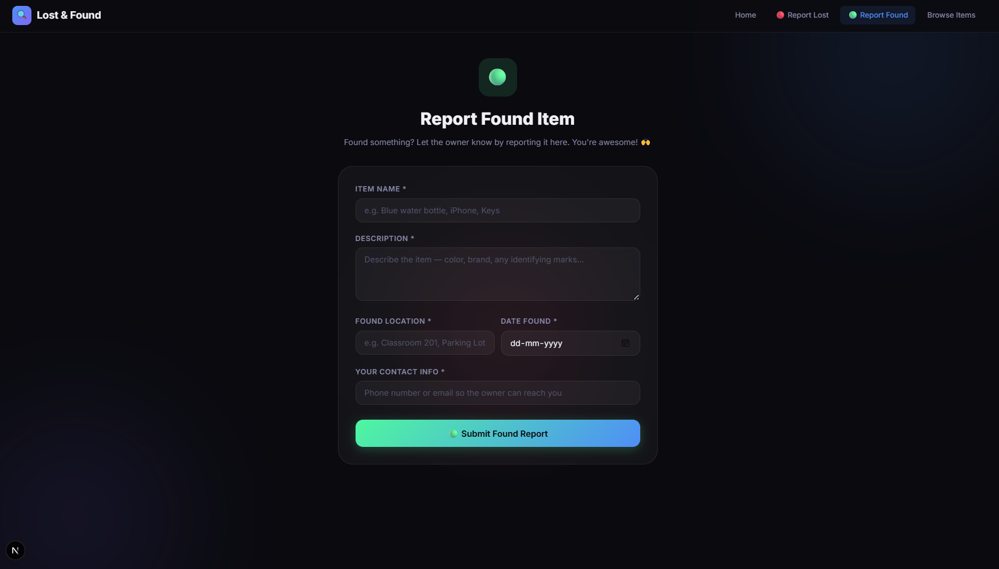
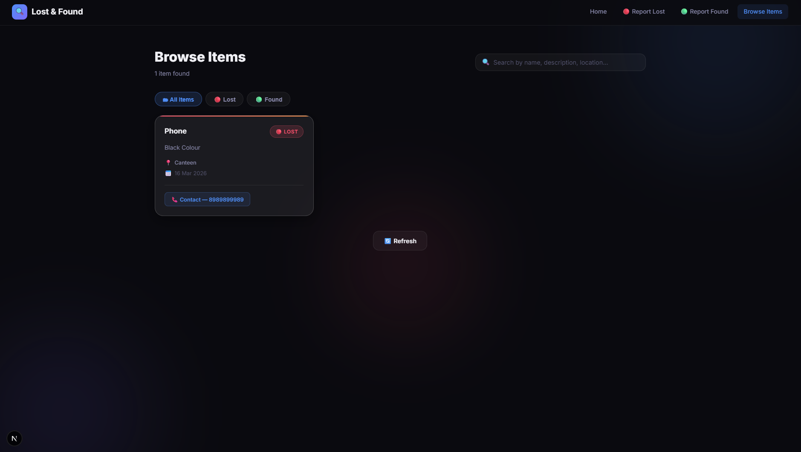

📦 Lost & Found Web Application

A simple and efficient Lost & Found management system that helps users report lost items and found items in a centralized platform. The application allows people to easily post item details and search through reports to recover lost belongings.

🚀 Project Overview

The Lost & Found Web Application is designed to simplify the process of reporting and locating lost items. Instead of relying on manual announcements or social media posts, this platform provides a centralized digital solution where users can submit lost or found item reports and view available records.

This project demonstrates full-stack development concepts, including frontend user interfaces, backend API development, and database management.

✨ Features

📌 Report Lost Items

📌 Report Found Items

📌 View all reported items

📌 Search through item listings

📌 Centralized item management

📌 Simple and user-friendly interface

🛠️ Tech Stack
Frontend

Next.js / React

HTML5

CSS3

JavaScript

Backend

Node.js

Express.js

Database

PostgreSQL / MongoDB

Tools

Git & GitHub

Postman (API testing)

🏗️ System Architecture
User
  ↓
Frontend (Next.js / React)
  ↓
Backend API (Node.js + Express)
  ↓
Database (PostgreSQL / MongoDB)

The frontend communicates with the backend through REST APIs, while the backend manages data storage and retrieval from the database.

📂 Project Structure
lost-found-project
│
├── frontend
│   ├── pages
│   ├── components
│   └── styles
│
├── backend
│   ├── routes
│   ├── controllers
│   ├── models
│   └── server.js
│
└── database
📡 API Endpoints
Report Lost Item
POST /api/lost
Report Found Item
POST /api/found
Get All Items
GET /api/items
🧩 Example Item Record
{
  "item_name": "Wallet",
  "description": "Black leather wallet",
  "location": "Library",
  "type": "lost",
  "contact": "9876543210"
}
⚙️ Installation & Setup
1️⃣ Clone the Repository
git clone https://github.com/itsvaibhav777/lost-found-project.git
2️⃣ Navigate to Project Folder
cd lost-found-project
3️⃣ Install Dependencies
npm install
4️⃣ Start Backend Server
npm start
5️⃣ Run Frontend
npm run dev
🎯 Use Case

This system can be used in places such as:

🏫 Colleges & Universities

🏢 Offices

🏬 Shopping Malls

🚉 Public Transport Stations

to manage lost and found items efficiently.

🔮 Future Improvements

🔍 Smart item matching

📷 Image upload support

🔔 Email notifications

🤖 AI-based item recognition

📱 Mobile-friendly interface

## 📸 Screenshots

### Home Page

### Report Lost Item

### Report Found Item

### Item List

🤝 Contributing

Contributions are welcome!
If you'd like to improve the project, feel free to fork the repository and submit a pull request.

📜 License

This project is open-source and available under the MIT License.

⭐ If you found this project useful, please consider starring the repository!
